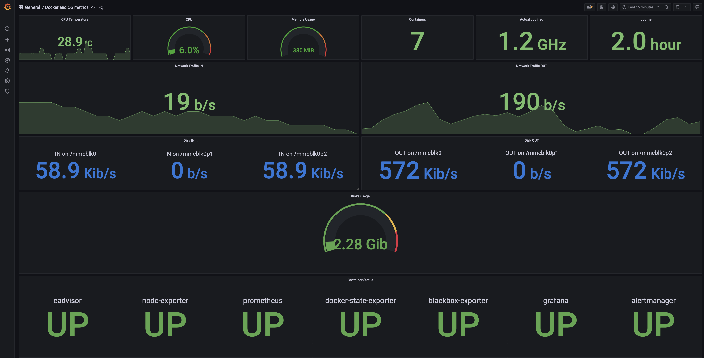

# rpi-monitoring
<div id="top"></div>


<!-- ABOUT THE PROJECT -->
## About The Project

This is a bundle for monitoring tools adapted for raspberry pi plateform (arm64) and optimized by default to limit cpu and memory usage. I recommend you to use 64bit base image instead of 32bit, threfore you cannot install some things like kubernates, or mongodb database(the apt repo's are outdated).

I make this to learn how I can monitor and have alert if something wrong happend. I've been inspired by this project:
* [dockprom](https://github.com/stefanprodan/dockprom), it's very complete bundle too but not oriented specificaly for RPI.


### Built With

* [Grafana](https://github.com/grafana/grafana) for vizualisation of your data, it's like watching your server heart beating, it's powerful and simple tool
* [Prometheus](https://github.com/prometheus/prometheus) for storage of your data (it's a serial database), prometheus is based on pull method for scrapping data
* [Prometheus/Alertmanager](https://github.com/prometheus/alertmanager) send alerts to many different recipient here I use slack.
* [Prometheus/node_exporter](https://github.com/prometheus/node_exporter) expose machine (node) metrics to permit prometheus to scrape them
* [Prometheus/blackbox_exporter](https://github.com/prometheus/blackbox_exporter) check a domain basic health metrics
* [cAdvisor](https://github.com/google/cadvisor) maintained by Google, export docker container metrics
* [docker-state-exporter](https://github.com/AdaptiveConsulting/docker_state_exporter) which is fork of [docker-state-exporter](https://github.com/karugaru/docker_state_exporter) - cAdvisor doesn't export containers health status, this exporter does


<!-- GETTING STARTED -->
## Getting Started
### Prerequisites

* [docker](https://docs.docker.com/get-docker/)
  ```sh
  $ curl -fsSL https://get.docker.com -o get-docker.sh
  $ sudo sh get-docker.sh
  $ sudo usermod -aG docker ${USER}
  $ sudo systemctl enable docker
  ```
* [docker-compose](https://dev.to/elalemanyo/how-to-install-docker-and-docker-compose-on-raspberry-pi-1mo)
  ```sh
  $ sudo apt-get install libffi-dev libssl-dev
  $ sudo apt install python3-dev
  $ sudo apt-get install -y python3 python3-pip
  $ sudo pip3 install docker-compose
  ```

### Installation

1. Create an slack app and get your slack api token for webhook => [slack doc](https://api.slack.com/messaging/webhooks)
2. Clone the repo
   ```sh
   git clone https://github.com/jerome-karabenli/rpi-monitoring.git
   ```
3. Paste your slack api token and your channel name in ``rpi-monitoring/alertmanager/config.yml``
   ```yaml
   global:
     resolve_timeout: 5m
     slack_api_url: '<your slack api url>'
   ```
   ```yaml
   - channel: '#<your alert channel>'
   ```
4. Set your domain name in ``rpi-monitoring/prometheus/prometheus.yml`` (optional)
   ```yml
   static_configs:
      - targets:
        - <your domain http adress>
   ```
5. Execute this command to create ``monitoring`` virtual network 
   ```sh
    docker network create monitoring
    ```
6. Execute this command in ``rpi-monitoring`` folder
    ```sh
    docker-compose up -d
    ```
7. Access to your grafana web ui from your browser on port 3000 ``http://machine-ip:3000``
8. Import [grafana dashboards](https://github.com/jerome-karabenli/rpi-monitoring/tree/main/dashboards) in json format - [grafana doc](https://grafana.com/docs/grafana/latest/dashboards/export-import/#import-dashboard)


[all images](https://github.com/jerome-karabenli/rpi-monitoring/tree/main/images)


<!-- ROADMAP -->
## Roadmap

- [x] Add Changelog
- [x] Add back to top links
- [ ] Add Additional Templates w/ Examples
- [ ] Add "components" document to easily copy & paste sections of the readme
- [ ] Multi-language Support
    - [ ] Chinese
    - [ ] Spanish

See the [open issues](https://github.com/jerome-karabenli/readme-template/issues) for a full list of proposed features (and known issues).


<!-- CONTRIBUTING -->
## Contributing

Contributions are what make the open source community such an amazing place to learn, inspire, and create. Any contributions you make are **greatly appreciated**.

If you have a suggestion that would make this better, please fork the repo and create a pull request. You can also simply open an issue with the tag "enhancement".
Don't forget to give the project a star! Thanks again!

1. Fork the Project
2. Create your Feature Branch (`git checkout -b feature/AmazingFeature`)
3. Commit your Changes (`git commit -m 'Add some AmazingFeature'`)
4. Push to the Branch (`git push origin feature/AmazingFeature`)
5. Open a Pull Request


<!-- LICENSE -->
## License

Distributed under the MIT License. See `LICENSE.txt` for more information.


<!-- CONTACT -->
## Contact

Jerome Karabenli - jkarabenli.dev@gmail.com

Project Link: [https://github.com/jerome-karabenli/rpi-monitoring](https://github.com/jerome-karabenli/rpi-monitoring)


<!-- ACKNOWLEDGMENTS -->
## Acknowledgments

* [Alertmanager alerts exemple](https://awesome-prometheus-alerts.grep.to/rules.html)
* [cAdvisor options](https://github.com/google/cadvisor/blob/master/docs/runtime_options.md)
* [Create customized slack alert notification](https://hodovi.cc/blog/creating-awesome-alertmanager-templates-for-slack/)


<!-- MORE -->
## More

I also use for my personal use case

* [nodeJS exporter](https://www.npmjs.com/package/express-prom-bundle) in this way I can monitor my express app's.
* [docker autoheal](https://hub.docker.com/r/willfarrell/autoheal/) permit to restart container if health checks fail (by default docker do nothing in this case, only docker swarm do it or kubernates by default)


